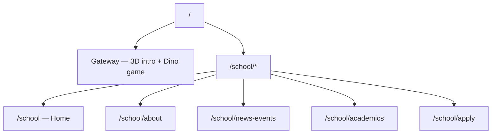

# Jericho School Website — Project Walkthrough

**Last updated:** May 21, 2026  
**Source design:** [Figma — School website](https://www.figma.com/design/12W7Fc7qMXXokgglobBZ22/School-website)

This file is the single place to see what exists today: routes, pages, features, assets, and known gaps.

---

## Quick start

```bash
npm i
npm run dev
```

| Script | Purpose |
|--------|---------|
| `npm run dev` | Vite dev server |
| `npm run build` | Production build |
| `npm run preview` | Preview production build |

**Stack:** React 18, Vite 6, React Router 7, Tailwind CSS 4, Radix/shadcn UI, Three.js, Motion, canvas-confetti.

---

## Site map (two experiences)



| URL | Page | File |
|-----|------|------|
| `/` | 3D Gateway + Dino Runner game | `src/app/pages/gateway.tsx` |
| `/school` | Home | `src/app/pages/home.tsx` |
| `/school/about` | About Us | `src/app/pages/about-us.tsx` |
| `/school/news-events` | News & Events | `src/app/pages/news-events.tsx` |
| `/school/academics` | Academics | `src/app/pages/academics.tsx` |
| `/school/apply` | Apply Now | `src/app/pages/apply-now.tsx` |

Routing is defined in `src/app/routes.tsx`. The main school site uses a shared `Layout` (`src/app/components/layout.tsx`) with header, footer, and Google Maps embed.

---

## 1. Gateway (`/`)

**File:** `src/app/pages/gateway.tsx` (~1,180 lines)

The landing experience is a full-screen **Three.js** scene with a cyberpunk-style UI overlay.

### Intro state (default)
- Animated 3D backdrop (bubbles, lighting, grid overlay)
- Logo + tagline: *Competence & Dignity*
- **Pay a Visit** → navigates to `/school`
- **Enroll Now** → opens `SubscriptionModal` (name, email, interest)
- **Enter 3D Dino Game** button
- Mute/unmute for synthesized Web Audio SFX
- After **5 minutes of inactivity**, the Dino Runner game starts automatically

### Dino Runner game
- Chrome-dino-style runner in 3D: jump over neon cacti
- Controls: Space, Up Arrow, or tap/click
- **Double jump** → mid-air backflip
- Score ticks +10 every 100ms (shown as “distance” in meters)
- Every **500m**: milestone sound + confetti, speed increases
- **High score** saved in `localStorage` key `jericho_runner_highscore`
- Game over → Run Again or Explore School Website

### Subscription modal
**File:** `src/app/components/subscription-modal.tsx`

- Collects name, email, interest (parent / student / community)
- Saves to `localStorage` key `jericho_subscribers`
- Confetti on success (no backend)

---

## 2. School layout (`/school/*`)

**File:** `src/app/components/layout.tsx`

Shared chrome for all school pages:

| Area | Content |
|------|---------|
| **Header** | Logo, nav links, light/dark toggle, link back to 3D Gateway |
| **Main** | `<Outlet />` for page content |
| **Maps** | Embedded Google Maps — Jericho School, Rwanda |
| **Footer** | Quick links, contact phones/email, hours, © 2026 |

**Navigation links:** Home, About Us, News & Events, Academics, Apply Now

**Theme:** `ThemeProvider` (`src/app/components/theme-provider.tsx`) — light/dark, persisted as `jericho-theme` in `localStorage`, respects system preference on first visit.

---

## 3. Home (`/school`)

**File:** `src/app/pages/home.tsx`

| Section | Details |
|---------|---------|
| **Hero** | `HeroSlideshow` — 6 images, 5s rotation, Motion fade transitions |
| **Why Choose** | 4 cards: Academic Excellence, Dedicated Teachers, Holistic Development, Future Ready |
| **Stats** | 800+ students, 95% success, 20+ teachers, 5+ years |
| **Gallery** | Learning Together, Cultural Heritage, Student Talent |
| **YouTube** | Embedded playlist + link to [@Jericho_school](https://www.youtube.com/@Jericho_school) |
| **CTA** | “Start Your Application” |

**Hero slideshow images** (`src/app/components/hero-slideshow.tsx`): hero, primary, culture, entertainment, discipline, competence.

---

## 4. About Us (`/school/about`)

**File:** `src/app/pages/about-us.tsx`

- Hero image (patriotism/graduation photo)
- **Our Story** — competence & dignity narrative
- **Mission / Vision / Values** — three cards
- **Core Principles** — Competence, Dignity, Character Building, Holistic Education
- Leadership team section exists in code but is **commented out**

---

## 5. Academics (`/school/academics`)

**File:** `src/app/pages/academics.tsx`

- Hero (nursery classroom image)
- **8 subject cards:** English, Math, Science, Social Studies, Languages, Creative Arts, Music & Cultural Arts, PE
- **Special programs:** Character Education, Cultural Programs, Public Speaking, Co-curricular
- **Programs by level** (tabs): Nursery, Primary (1–3), Upper Primary — each with bullet lists
- Additional imagery: discipline/uniform photo

---

## 6. News & Events (`/school/news-events`)

**File:** `src/app/pages/news-events.tsx`

| Block | Behavior |
|-------|----------|
| **Latest news** | Fetches YouTube RSS via [rss2json](https://api.rss2json.com) for channel `UCQhwMKHOFNsKuuBI1xb5qRw` |
| **Upcoming events** | Static list (e.g. Graduation Ceremony 2026 — Aug 20) |
| **YouTube CTA** | Link to channel |

Loading and error states are handled in the UI.

---

## 7. Apply Now (`/school/apply`)

**File:** `src/app/pages/apply-now.tsx`

- 4-step process overview (Submit → Visit → Decision → Enroll)
- **Application form** (client-side only):
  - Student: name, DOB, grade (Nursery–Primary 6)
  - Parent/guardian: name, phone, email, address
  - Additional notes textarea
- On submit → success screen (“Application Submitted!”)
- **No API/backend** — form does not send data anywhere yet

---

## Project structure

```
JSW/
├── index.html
├── package.json
├── vite.config.ts          # @ → src alias
├── README.md               # minimal Figma/run instructions
├── ATTRIBUTIONS.md         # shadcn/ui, Unsplash
├── WALKTHROUGH.md          # this file
├── Images/                 # duplicate/source images (root)
└── src/
    ├── main.tsx
    ├── styles/
    │   ├── index.css
    │   ├── tailwind.css
    │   ├── theme.css
    │   └── fonts.css
    ├── assets/
    │   └── images/         # logo, hero, primary, culture, etc.
    └── app/
        ├── App.tsx
        ├── routes.tsx
        ├── components/
        │   ├── layout.tsx
        │   ├── hero-slideshow.tsx
        │   ├── subscription-modal.tsx
        │   ├── theme-provider.tsx
        │   ├── figma/ImageWithFallback.tsx
        │   └── ui/         # full shadcn/ui kit (~40 components)
        └── pages/
            ├── gateway.tsx
            ├── home.tsx
            ├── about-us.tsx
            ├── academics.tsx
            ├── news-events.tsx
            └── apply-now.tsx
```

---

## Assets

| Asset | Used for |
|-------|----------|
| `logo.png` | Header, footer, gateway |
| `hero.jpg` | Home slideshow |
| `primary.jpg` | Classroom / gallery |
| `nursery.jpg` | Academics hero |
| `culture.jpg` | Cultural dance |
| `entertainment.jpg` | Performances |
| `discipline.jpg` | Uniforms / slideshow |
| `competence.jpg` | Slideshow |
| `patriotism.jpg` | About hero |
| `languages.jpg` | Available in assets |

Images live under `src/assets/images/` (imported via `@/assets/...`). A parallel `Images/` folder at repo root mirrors some files.

---

## Local storage keys

| Key | Purpose |
|-----|---------|
| `jericho-theme` | `light` \| `dark` |
| `jericho_runner_highscore` | Dino game high score |
| `jericho_subscribers` | Gateway enroll modal submissions (JSON array) |

---

## External integrations

| Service | Where |
|---------|-------|
| Google Maps embed | Layout footer |
| YouTube channel | Home, News & Events |
| YouTube RSS → rss2json | News & Events feed |
| Web Audio API | Gateway jump/crash/milestone sounds |

---

## UI / design system

- **Tailwind 4** with custom utilities: `glass`, `glass-card`, `section-transition`, `hover-lift`, `img-hover-zoom`
- **shadcn/ui** Radix primitives in `src/app/components/ui/`
- **Lucide** icons throughout
- **Motion** (`motion/react`) for slideshow transitions
- **Dark mode** on all school pages via `dark:` classes

---

## Known issues / not done yet

1. **Broken links on Home** — several `Link` targets omit the `/school` prefix:
   - `/apply` → should be `/school/apply`
   - `/about` → should be `/school/about`
   - `/news-events` → should be `/school/news-events`

2. **Forms are front-end only** — Apply Now and Enroll modal do not POST to email, CRM, or database.

3. **Leadership team** on About Us is commented out, not visible.

4. **Duplicate image folders** — `Images/` at root and `src/assets/images/`; prefer one canonical location.

5. **Large UI kit** — many `ui/*` components are installed from Figma Make but unused on current pages.

6. **Gateway comment mismatch** — code comment says “10s” inactivity; timer is `300000` ms (5 minutes).

---

## Contact info (as shown on site)

- **Phones:** (+250) 788 490 200, 788 695 562, 788 622 914  
- **Email:** jerichoschoolweb@gmail.com  
- **Hours:** Mon–Fri 8–5, Sat 9–1, Sun closed  
- **Motto:** Competence & Dignity  

---

## How to extend next

Typical next steps, in order of impact:

1. Fix Home page router links (`/school/...`).
2. Wire Apply form + subscription modal to email (Formspree, Resend, or school API).
3. Uncomment or rebuild leadership section on About.
4. Add real news/events CMS or keep YouTube-only feed.
5. Trim unused `ui/` components if bundle size matters.

---

*For run instructions only, see `README.md`. For licenses, see `ATTRIBUTIONS.md`.*
